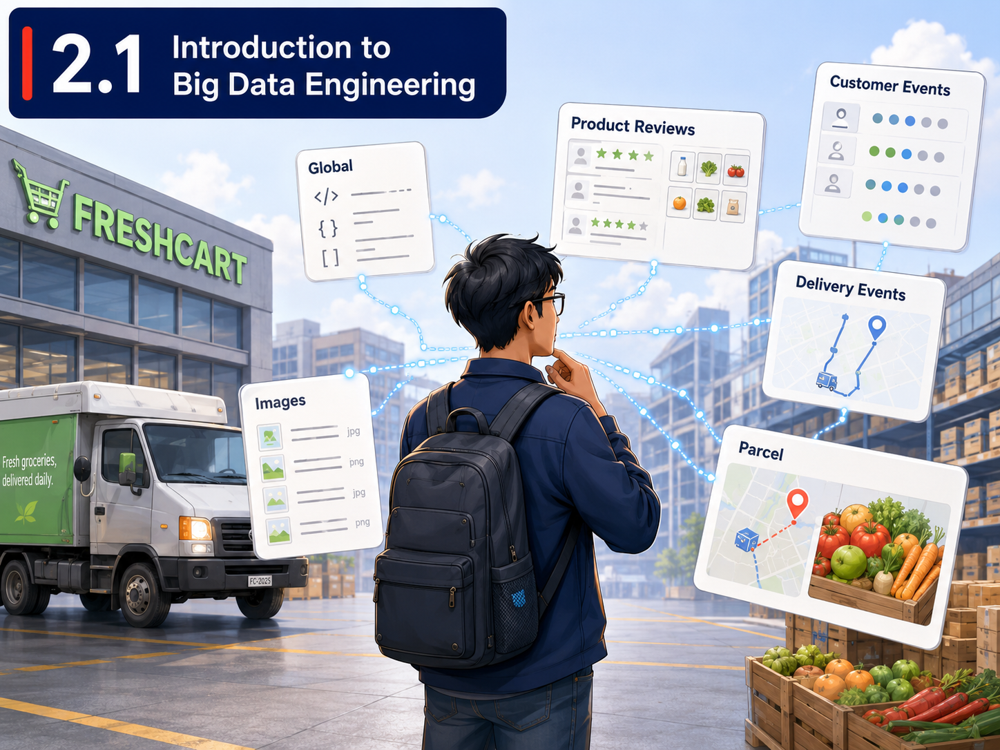

# Module 2: Your Data Engineering Journey

### A Field Guide for Building your First Data Platform

--- 

## The Story So Far...

In Module 1, you learned to work with data at the desk level — Python, pandas, SQL, and exploratory analysis. You can read data, clean it, query it, and draw insights from it.

That's the equivalent of being able to read and write.

Module 2 is about learning to build the *plumbing* — the infrastructure that moves, stores, transforms, and serves data at scale, reliably, every day, without you manually running scripts.

---

## Meet FreshCart

You've just been hired as a *Junior Data Engineer* at **FreshCart**, a mid-sized e-commerce grocery company in Singapore with around 200 employees. FreshCart sells fresh produce, household essentials and everyday consumer goods through its website and mobile app.

The company generates data from multiple sources: 
- Transactional database (PostgreSQL)
- Website and mobile app (event logs) 
- Third-party logistics partners (APIs)
- Marketing platforms
- Various customer reviews scraped from online social media

On your first day, your manager tells you:

> *"We have data everywhere, but nobody trusts the numbers in our dashboards. The marketing team pulls different figures from the data team. Our analysts spend 60% of their time cleaning spreadsheets. We need you to help us build a proper data platform."*

Over the next 10 lessons, that's exactly what you'll do.

# The Architecture You're Building

Every lesson in Module 2 adds a new layer to a modern data platform. By the end of the module, you'll have touched every major component of the system that a company like FreshCart would actually use.

```
 Sources  →  Storage  →  Ingestion  →  Transformation  →  Serving
(2.1–2.4)    (2.2)     (2.4, 2.6)    (2.5, 2.7, 2.8)   (2.5, 2.9, 2.10)
```

Think of this as the map. Each unit lights up a new section.

Let's get started!

---



## Where are we?

It's your first day. Your manager walks you through the company's data landscape and asks a deceptively simple question: *"What kind of data do we have, and where does it live?"*

FreshCart's transactional orders sit in a PostgreSQL database. Customer reviews are unstructured text. Real-time delivery tracking is semi-structured JSON from a logistics API. Product catalogue images are binary blobs. You realise that "data" is not one thing — and the tools you learned in Module 1 only handle part of the picture.

## Why this matters

Before you can build anything, you need a mental model of the data engineering landscape. This unit gives you the vocabulary and conceptual framework to distinguish between different types of data, different types of databases, and different processing paradigms. Without this, every subsequent technical decision will lack context.